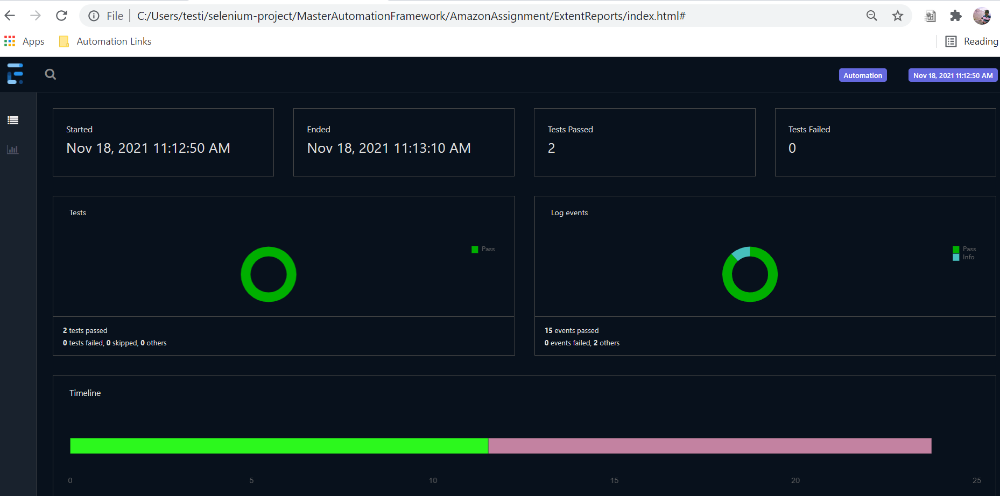
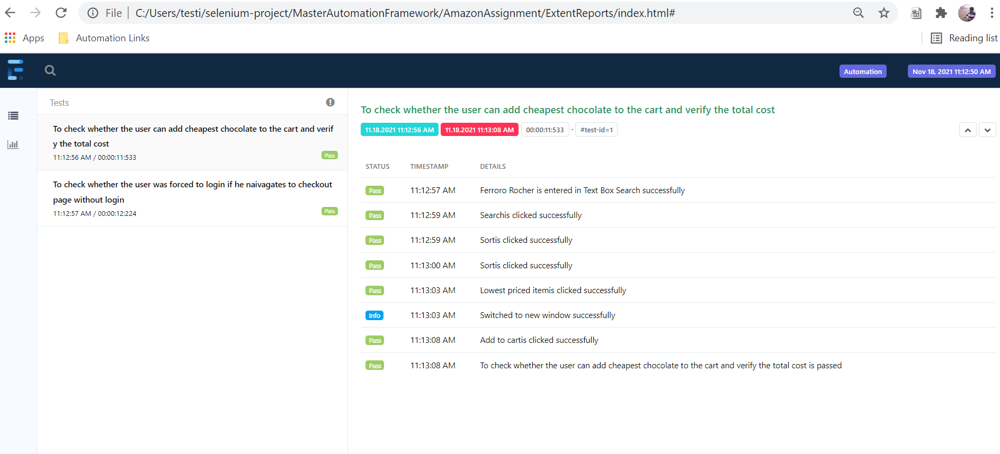
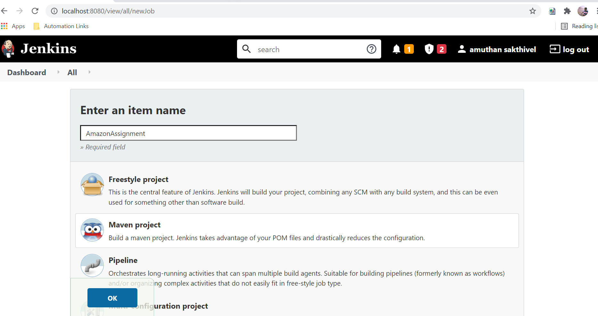
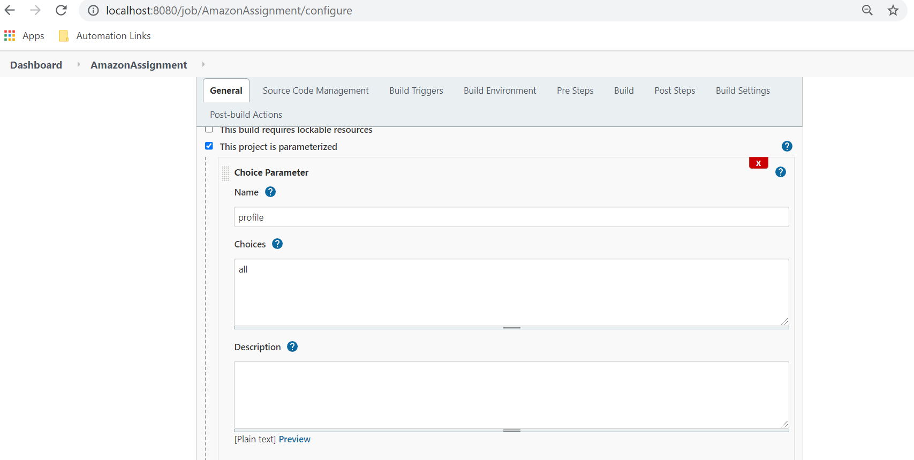
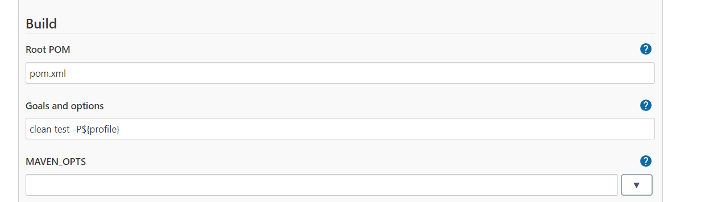
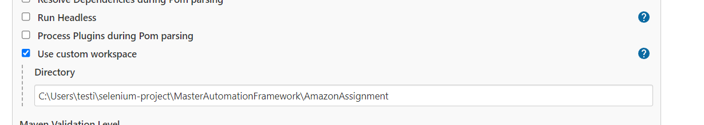
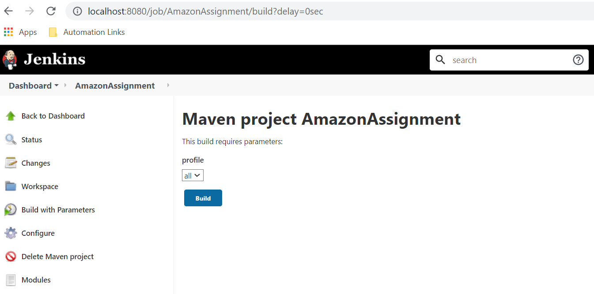
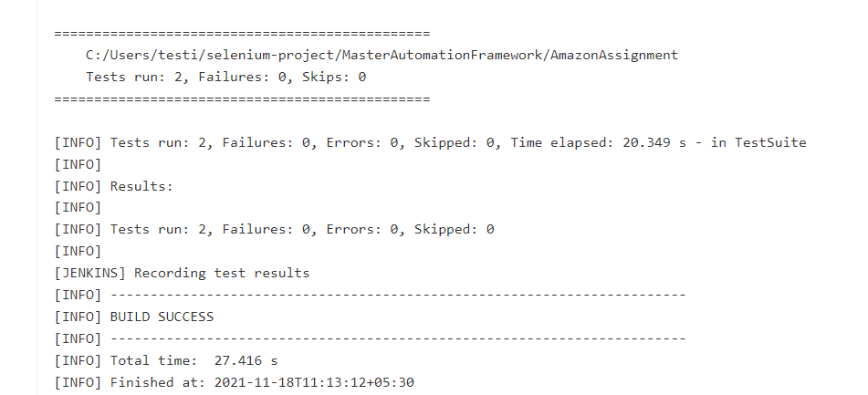

# Amazon Assignment - Personio

## Libraries Used :

1. **Selenium** - Web Automation
2. **TestNG** - Unit Testing Library
3. **Extent Reports** - Reporting Library to generate beautiful html reports
4. **AssertJ** - Fluent Assertion Library in Java
5. **WebDriverManager** - Executables management
6. **Lombok** - To reduce boilerplate codes

**Note : All the aforementioned libraries are open-source and does not include any license.**

## Capabilities:

1. This framework has the capability to run the tests in local machine only.
2. Web Tests can be ran on chrome or edge browsers.
3. Configuration can be changed from config.properties inside src/test/resources
4. Utility methods available for Web Interactions *(SeleniumActions.java)*
5. Integration with Jenkins for scheduling is easy. :raising_hand:

## Adding more tests :

Prerequisites: Java 8+ , Maven 3.6.3 Installed and path set

1. Tests should be added as per the convention followed. New testng tests should be created inside the src/test/java
   folder.
2. All the tests should extend BaseTest.java
3. Each test created should define the description as mandatory parameters. This will be helpful while creating
   the extent reports.
4. All the tests should be follow AAA pattern - **ARRANGE, ACT and ASSERT**
5. Have maximum of one to two assertions per test.
6. Tests should interact only with the Facade layer. This can be used to wrap the business logic.

## Running Tests :

Prerequisites: Java 8+ , Maven 3.6.3 Installed and path set

1. There are multiple ways to run the tests. During development phase you can use the **testng.xml** present in the root folder to run. Right click and choose run.
2. Each of the testng xml file should contain the test classes to pick for the run.
3. User can also choose the thread-count parameter to run the tests in parallel.
4. User can also choose to run via maven commands which is highly recommended.
5. Maven profiles are configured in the pom.xml. You can run these from IDE Terminal or any OS Terminal inside the
   project folder.

`mvn clean test -Pall` - To run all the tests available in the testng.xml

Note : User should not try to run the test from test class - Might end up in NPE. Because the listeners are configured only in testng.xml

## Report Interpretation :

1. Dashboard view clearly indicates the start time, end time of the run, number of tests passed and failed. It also
   shows the time took for the individual tests in form of timeline. Hover the mouse over the timeline to get the exact
   time details.

2. Tags tab in the Dashboard view clearly indicates the pass and fail according to the functionality.
3. Click on each test tab to view the corresponding test log events.
4. All the web tests will have a screenshot attached on failure
5. After each test run, reports can be found under root directory and ExtentReports folder.
6. Press "l" on the keyboard after opening the report to switch the theme to Standard.

## Jenkins Integration :

1. This project can be integrated easily with Jenkins.
2. Login to Jenkins
3. Create Maven Project(Add maven plugin if not present)

4. Configure choice parameters to run different maven profiles

5. Configure goal and options

6. Choose custom workspace and give the project location

7. To run, select Build with parameters -> Choose Profile -> Click build

8. View the results in the console output.

## Questions :

For any further clarification - please reach out to `mech.amuthansakthivel@gmail.com`

